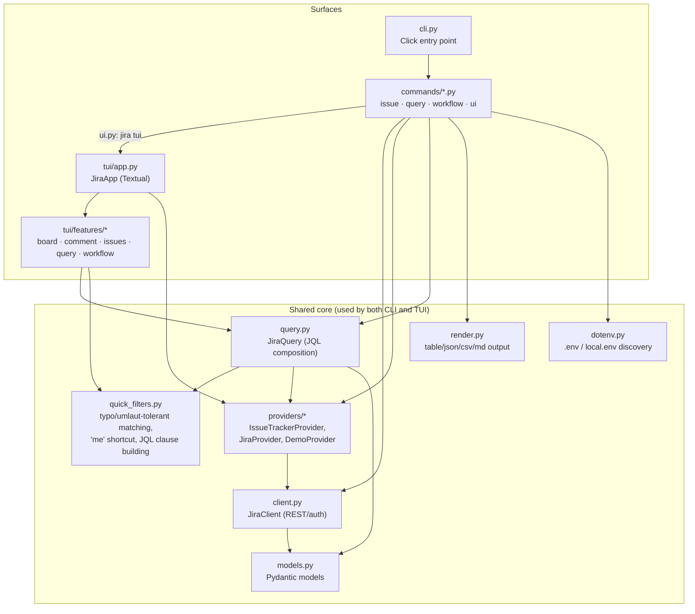

# Architecture

`jira-cli` has one shared core (client, query building, models, rendering) used identically
by two thin surfaces: the CLI (Click) and the TUI (Textual).

## Modules

- **providers/** — provider contract, static resource/filter/action descriptors, and Jira/demo
  provider implementations. CLI/TUI/query services type against `IssueTrackerProvider` so future
  GitHub/GitLab providers have a clear integration boundary.
- **client.py** — `JiraClient`: Jira REST calls, auth, `myself`/assignable-users lookups.
- **query.py** — `JiraQuery`: JQL composition (`project = ... AND ...`) and search execution.
- **quick_filters.py** — shared, non-TUI-specific resolution logic: umlaut/diacritic-tolerant
  matching, the `me` → `currentUser()` shortcut, and JQL clause building. Used identically by
  `query.py` (CLI `--assignee`/`--status`/`--label`) and the TUI's `:` command bar, so a fix here
  benefits both surfaces at once.
- **models.py** — Pydantic models for Jira API responses and the flattened `IssueRow`.
- **render.py** — `JiraRenderer`: table/JSON/CSV/Markdown output for the CLI.
- **dotenv.py** — `.env`/`local.env` discovery (CWD or parent directories).
- **cli.py** — Click command group wiring; **commands/\*.py** — thin, delegating command handlers.

## TUI layer

- **tui/app.py** — `JiraApp`: Textual application, screen composition, key bindings, the `:`
  command bar dispatch.
- **tui/header.py** — header widget showing the current Jira user next to the clock.
- **tui/features/\*** — one package per concern (board view, comments, issue table/detail,
  query/quick-filter service + suggester, workflow actions).

## Design notes

- Keep provider capabilities data-driven through `ProviderDescriptor`; avoid hard-coding that every
  tracker must look exactly like Jira.
- Keep Jira transport concerns in `JiraClient`; keep query assembly in `JiraQuery`.
- Keep matching/resolution logic that both surfaces need in `quick_filters.py`, not duplicated
  under `tui/`.
- Keep output formatting in `JiraRenderer`; keep TUI orchestration in `tui/app.py`.
- Keep CLI commands thin and delegating.
- Quick filters (type/status/assignee/label) are always executed server-side (JQL) — never a
  local-only filter over an already-loaded page of issues.
