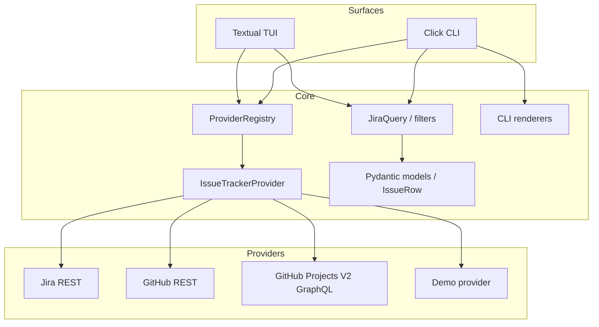

# Architecture

`jira-cli` has two user-facing surfaces, a Click CLI and a Textual TUI, backed by a shared provider-oriented core.

## Current Design

### Shared provider contract

The CLI, TUI, and query services depend on `IssueTrackerProvider`, not on a concrete tracker client. Provider descriptors expose resource kinds, filters, sorts, actions, and capabilities such as board support.

`ProviderContext` identifies the active tracker and target. Examples include:

- Jira project: `jira:COM`
- GitHub repository: `github:colenio/jira-cli`
- GitHub Project V2: `github:colenio/21`
- Demo context: `demo:DEMO`

`ProviderRegistry` discovers contexts from explicit options, environment variables, Git remotes, and `gh auth`. When more than one real context is available, the TUI can ask the user to choose one.

### Provider implementations

The Jira provider uses the existing Jira REST client. The GitHub provider uses `githubkit` for REST and GraphQL. A single GitHub provider selects repository Issues or Project V2 behavior from the target shape.

GitHub Projects V2 is a separate resource context because it can contain issues and pull requests from multiple repositories. Project status fields and item mutations are handled through GraphQL.

The Demo provider supplies deterministic data for screenshots and tests without network access.

### Canonical issue model

Provider-specific payloads are normalized into `JiraIssue` and `IssueRow` models. Canonical fields include:

- key
- summary/title
- description
- status
- priority
- assignee
- reporter/creator
- labels
- updated timestamp
- parent and child relationships where available

The name `reporter` is used as the provider-neutral concept. Jira maps it from `fields.reporter`; GitHub maps it from the issue `user` or GraphQL `author`.

### Content conversion

Jira Cloud uses Atlassian Document Format (ADF). The project uses the pinned `md-adf` dependency behind `jira_cli.adf`:

- ADF to Markdown for display
- Markdown/plain text to ADF for Jira writes
- diagnostics and a conservative plain-text fallback for unsupported nodes

GitHub comments and descriptions remain Markdown. Conversion is therefore a Jira adapter concern, not a shared domain-model concern.

### TUI architecture

The Textual application owns high-level state and navigation. Feature packages own focused behavior:

- board navigation and status columns
- issue table and detail view
- query bar and server-side filters
- comments and thread navigation
- workflow transitions and assignment
- modal editing and comment composition

Blocking provider operations such as assignment and transitions run in Textual workers so network latency does not freeze the event loop.

## Diátaxis Documentation Map

The documentation is organized by purpose:

- **Tutorials:** guided first-use material for new users.
- **How-to guides:** focused procedures for configuration, workflows, and releases.
- **Reference:** command options, provider capabilities, and API details.
- **Explanation:** architecture, provider choices, design trade-offs, and migration assessments.

This page is an explanation document. It describes why the system is structured this way, not a step-by-step setup procedure.

## Rust and Ratatui Assessment

Ratatui is a strong technical option for a future native TUI. It is actively maintained, MIT-licensed, has many contributors and releases, and provides direct control over terminal rendering, layout, widgets, and keyboard input.

A port would nevertheless rebuild much more than the current Textual layer:

- Click commands would become `clap` commands.
- Pydantic models would become `serde` structures.
- Jira REST, GitHub REST, and GitHub GraphQL clients would need Rust implementations.
- ADF/Markdown conversion and diagnostics would need a Rust solution.
- Textual screens, workers, focus handling, modals, and message flow would become explicit application state.
- The existing provider, CLI, TUI, and integration tests would need new implementations.

The rough effort for feature parity is **5–10 person-weeks**. A read-only GitHub Project V2 pilot is closer to **3–7 days**.

### Recommendation

Do not start a full rewrite yet. Keep Python as the productive reference and build a small separate Rust/Ratatui pilot only when there is a concrete reason, such as native binary distribution, startup/resource constraints, or a strategic decision to make Rust the long-term multi-provider core.

The pilot should initially:

- load a GitHub Project V2 with `clap`
- authenticate through `GH_TOKEN` or `gh auth token`
- query items through `reqwest` and GraphQL
- render a table and status board
- support a repository filter
- include loading, error, empty, and snapshot-test states
- perform no writes

This keeps the experiment reversible and measures the actual cost before committing the project to a second implementation.

## Design Principles

- Keep provider behavior behind the shared contract.
- Keep filter resolution and query construction outside the TUI widgets.
- Keep network and tracker-specific conversion in providers.
- Treat capabilities as data; do not assume every tracker has boards, milestones, or the same workflow.
- Prefer small, testable feature services over a large TUI controller.
