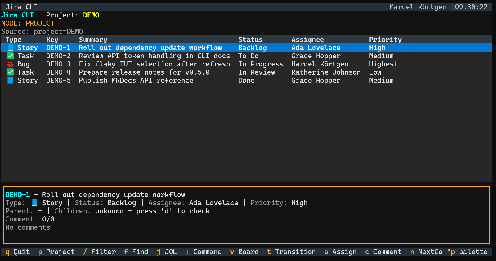
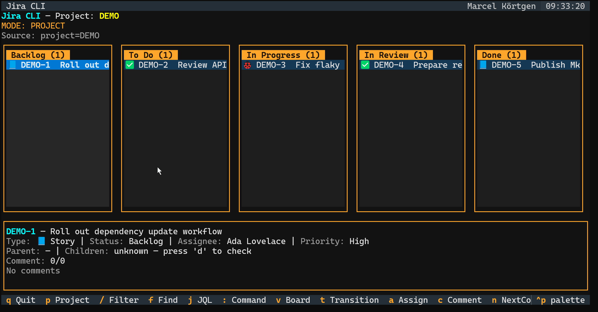
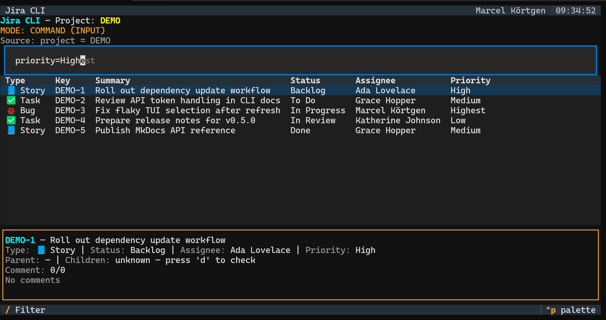
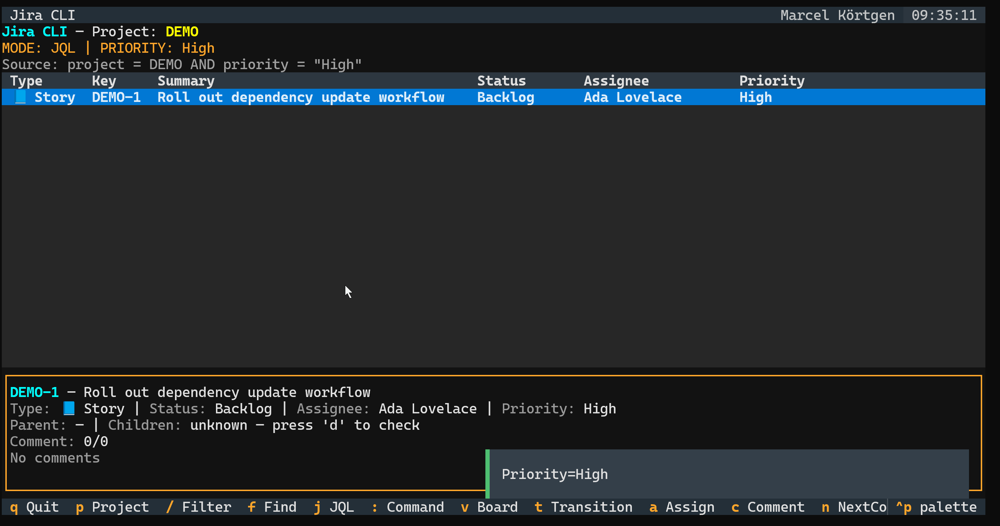
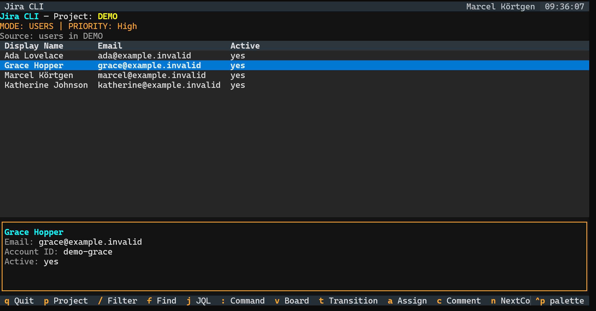
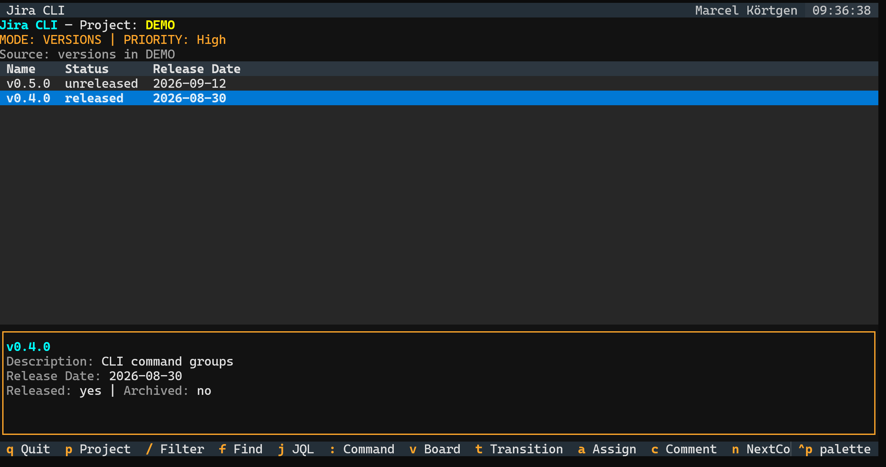

# Features

## What can I do with `jira-cli`?

Everything you'd do in Jira Cloud's issue list/board for day-to-day triage — from a terminal, scriptable, and fast:

- **Browse and drill in**: list a project, search by JQL, free-text find, view an issue with
  comments, drill up to a parent / down to children (Epic -> Story/Task, Story -> Sub-task).
- **Act on issues**: create, comment (plain/Markdown/ADF), edit fields, assign, transition,
  close/reopen — via CLI flags or interactively in the TUI.
- **Stay on top of deadlines**: `issue overdue [--mine]` (CLI) / `:overdue[=me]` (TUI) — due
  date passed, not yet done, server-side JQL.
- **Manage milestones**: `jira version list/create/delete` for fix versions.
- **Look up people**: `jira user me` / `jira user list --project PROJ` (project members) /
  `jira user search <query>` (global Jira user directory).
- **Narrow down fast**: quick filters (`type=`, `status=`, `assignee=`, `assignee=me`, `label=`)
  that run as real, combinable JQL server-side — not a local search limited to whatever's
  already on screen — plus a live in-memory `/` filter for instant re-slicing of the current view.
- **See it two ways**: a sortable table, or a poor-man's kanban board grouped by status — same
  selection, same actions, either view.
- **Script it**: table/JSON/CSV/Markdown output for piping into other tools.

## Feature parity with the Jira Cloud web UI

<!-- prettier-ignore -->
| Area | Jira Cloud web UI | `jira-cli` |
| ---- | ----------------- | ---------- |
| Browse issues by project/JQL | ✅ | ✅ (CLI + TUI) |
| Free-text search | ✅ | ✅ `issue find` / TUI `f` |
| View issue + comments | ✅ | ✅ `issue view --comments` / TUI detail pane |
| Create / edit / comment | ✅ | ✅ |
| Transition workflow status | ✅ | ✅ (by name or transition ID) |
| Assign issue, incl. "assign to me" | ✅ | ✅ (`issue assign`, TUI `a`, `:assignee=me`) |
| Quick filters (type/status/assignee/label) | ✅ (board quick-filter chips) | ✅ `:` command bar, always server-side |
| Board grouped by status | ✅ (drag-and-drop) | ⚠️ view-only board (`v`) — no drag-and-drop, no column reordering |
| Parent/child (epic ↔ story/subtask) navigation | ✅ | ✅ `issue children`, drill up/down (`u`/`d`) |
| Overdue issues | ✅ (JQL/filters) | ✅ `issue overdue [--mine]` / TUI `:overdue[=me]` |
| Fix versions / milestones | ✅ | ✅ `jira version list/create/delete` |
| User lookup | ✅ | ✅ `jira user me` / `jira user list` / `jira user search` |
| Sprints / Backlog (Scrum) | ✅ | ❌ not modeled at all |
| Swimlanes, WIP limits, column config | ✅ | ❌ |
| Bulk edit / bulk transition | ✅ | ❌ (one issue at a time) |
| Attachments | ✅ | ❌ |
| Watchers / notifications | ✅ | ❌ |
| Worklog / time tracking | ✅ | ❌ |
| Saved filters / dashboards | ✅ | ❌ (JQL is typed fresh each time; no persistence yet) |
| Roadmap / timeline | ✅ | ❌ |
| Automation rules | ✅ | ❌ (out of scope by design — this is a query/action tool, not a rules engine) |

## What's missing (candidates for future work)

See the repository `ROADMAP.md` for the
tracked backlog. Highlights from the table above: Scrum sprint/backlog awareness, bulk
actions, saved filters, attachment handling, and reporting (CFD/burndown/burnup) are the
biggest gaps versus the web UI.

## CLI (`jira-cli issue ...` / `jira issue ...`)

| Feature                                                       | Command                                   |
| ------------------------------------------------------------- | ----------------------------------------- |
| List issues by project (+ status/assignee/label/type filters) | `issue list --project PROJ`               |
| Custom JQL search                                             | `issue search '<jql>'`                    |
| Free-text find (summary/description, or exact key)            | `issue find --project PROJ "text"`        |
| View issue details (+ comments)                               | `issue view PROJ-123 --comments`          |
| Child issues (Epic -> Story/Task, Story -> Sub-task)          | `issue children PROJ-123`                 |
| Overdue issues (+ optionally only mine)                       | `issue overdue --mine`                    |
| Assign issue                                                  | `issue assign PROJ-123 user@example.com`  |
| Transition issue (+ optional comment)                         | `issue transition PROJ-123 "In Progress"` |
| Create issue                                                  | `issue create ...`                        |
| Comment (plain/markdown/ADF)                                  | `issue comment PROJ-123 "text"`           |
| Edit issue fields                                             | `issue edit PROJ-123 ...`                 |
| Output formats                                                | `--format table\|json\|csv\|md`           |
| Credentials via `.env`/`local.env`                            | auto-discovered in CWD or parent dirs     |

Run `jira issue --help` (or `--help` on any subcommand) for the full, current flag list — that's
the source of truth, not this table.

## Other command groups

- `jira version list/create/delete` — fix versions (milestones).
- `jira user me` — the authenticated account's info.
- `jira user list --project PROJ` — users assignable to issues in a project (project members).
- `jira user search <query>` — global Jira user directory lookup. Falls back to the
  project-scoped assignable-users search (`--project`/`JIRA_PROJECT`) if the global search returns nothing — Jira Cloud silently returns an empty list there without the "Browse users and groups" permission, which many orgs restrict.

## TUI (`jira-cli tui --project PROJ` / `jira tui --project PROJ`)

Two views (`v` toggles): a sortable **table**, and a **board** grouped by status (view-only —
selection, detail pane, transition/assign/comment work the same in both).

Use `jira tui --demo` to launch the same TUI with synthetic issues, users, comments, and
milestones. This is intended for safe screenshots and screencasts without exposing customer
Jira data.

Use `jira tui --provider github -R owner/name` to browse GitHub Issues read-only. The GitHub
provider uses `GH_TOKEN` or the existing `gh auth login` session, and can infer the
repository from the current GitHub remote when `-R` is omitted.

### TUI screenshots

The issue table is the default workspace for triage. It keeps status, assignee, and priority
visible while the detail pane tracks the selected issue.

The board view uses the same issue source, grouped by status for a compact Kanban-style scan.

The `:` command bar is the main navigation and filtering surface, with suggestions for views,
resource kinds, and server-side quick filters.

Quick filters run as Jira-side JQL and update the active source context, instead of filtering
only the currently loaded rows.

Users are a first-class TUI resource view, matching the `jira user ...` CLI group.

Versions and milestones use their own resource view as well, matching `jira version list`.

Header shows the current Jira user (via `/myself`, fetched at startup) next to the clock.

Navigation: `/` for an instant local filter over the currently loaded issues, `f`/`j` to run a remote find/JQL query, `u`/`d` to drill to parent/child issues, `p`/`Esc` to reset to the project view, `r` to refresh.

`d` (drill down) works for both sub-tasks and Epic children: it uses locally known sub-tasks if
present, otherwise queries Jira for `parent = <key>` — the field modern Jira Cloud hierarchy uses
for Epic → Story/Task (and Story → Sub-task) children.

`f` (and CLI `issue find`) also match by exact issue key: typing `PROJ-123` finds that issue directly, in addition to the usual summary/description text search.

### Quick filters (k9s/sofka-style `:` command bar — always server-side JQL)

- `:` opens an autocompleting command bar (suggests verbs and known values as you type).
- `table` / `board` — switch view.
- `type=<value>`, `status=<value>`, `assignee=<value>`, `assignee=none` (or `unassigned`), `label=<value>`, `key=<value>` — run a
  real JQL query (`issuetype = "..."`, `status = "..."`, `assignee = "..."`, `labels = "..."`,
  `key = ...`), combinable (ANDed), never limited to whatever's already loaded. `key=` is a
  direct jump to one issue (e.g. `key=proj-123`).
- `assignee=me` — JQL `assignee = currentUser()`, resolved by Jira itself.
- Values are umlaut/diacritic-tolerant and typo-forgiving: first a substring match against
  currently loaded issues, then Jira's assignable-users search for `assignee=` (so it finds
  people even with none of their issues loaded yet).
- `clear` — clear all quick filters, back to `project = <PROJ>`.
- A bare `<value>` (no verb) guesses the dimension (type/status/assignee/label, in that order),
  sofka-palette style.

### Keyboard reference

| Key       | Action                            | Key     | Action                |
| --------- | --------------------------------- | ------- | --------------------- |
| `↑`/`↓`   | Navigate issues                   | `t`     | Transition issue      |
| `Enter`   | Open/execute active input         | `a`     | Assign issue          |
| `/`       | Live filter                       | `c`     | Comment               |
| `:`       | Command bar (quick filters, view) | `n`/`b` | Next/prev comment     |
| `f`       | Find by text (remote)             | `u`/`d` | Drill to parent/child |
| `j`       | Custom JQL (remote)               | `o`     | Open in browser       |
| `v`       | Toggle board view                 | `r`     | Refresh               |
| `p`/`Esc` | Reset to project / close input    | `?`/`q` | Help / quit           |
